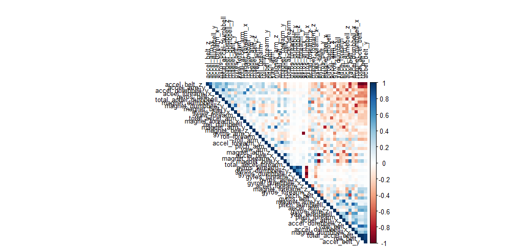
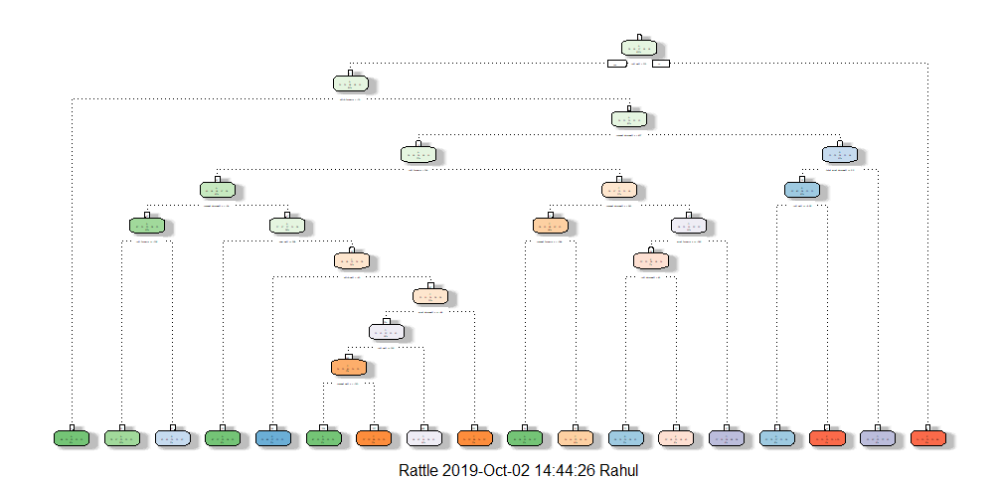
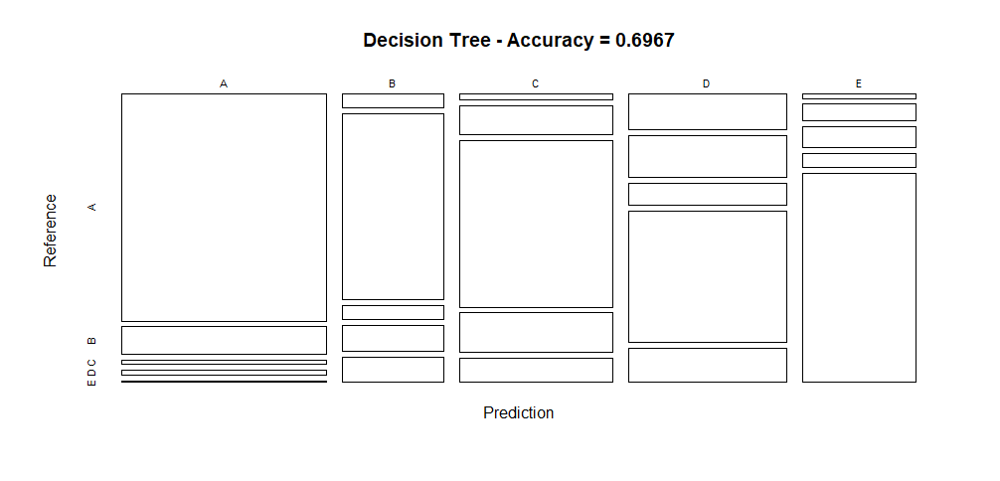
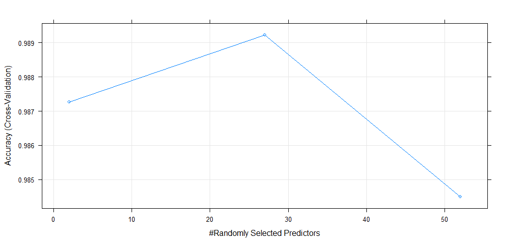
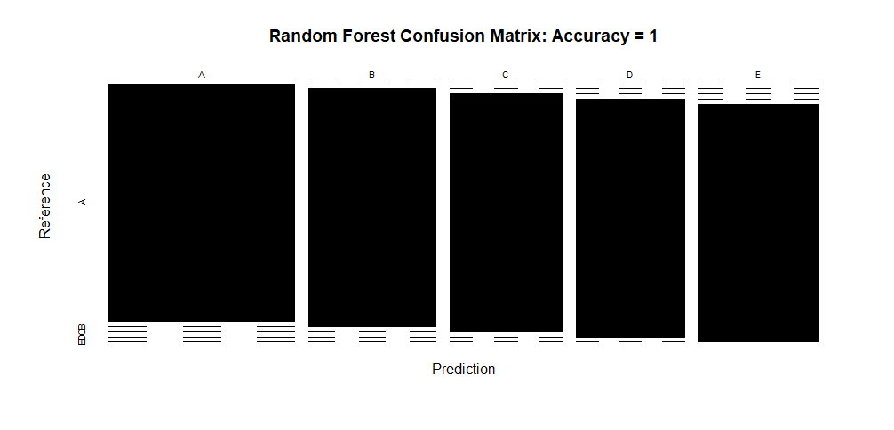

## Introduction  
Using devices such as Jawbone Up, Nike FuelBand, and Fitbit it is now possible to collect a large amount of data about personal activity relatively inexpensively. These type of devices are part of the quantified self movement – a group of enthusiasts who take measurements about themselves regularly to improve their health, to find patterns in their behavior, or because they are tech geeks. One thing that people regularly do is quantify how much of a particular activity they do, but they rarely quantify how well they do it.  

In this project, we will use data from accelerometers on the belt, forearm, arm, and dumbell of 6 participants to predict the manner in which they did the exercise.  

## Data Preprocessing  

```r
library(caret)
library(rpart)
library(rpart.plot)
library(RColorBrewer)
library(rattle)
library(randomForest)
library(corrplot)
library(gbm)
```

### Read the Data
After downloading the data from the data source, we can read the two csv files into two data frames.  

```r
train_in <- read.csv("pml-training.csv", header=T)
valid_in <- read.csv("pml-testing.csv", header=T)
dim(train_in)
```

```
## [1] 19622   160
```

```r
dim(valid_in)
```

```
## [1]  20 160
```
The training data set contains 19622 observations and 160 variables, while the testing data set contains 20 observations and 160 variables. The "classe" variable in the training set is the outcome to predict.

### Clean the data
In this step, we will clean the data and get rid of observations with missing values as well as some meaningless variables.

```r
trainData<- train_in[, colSums(is.na(train_in)) == 0]
validData <- valid_in[, colSums(is.na(valid_in)) == 0]
dim(trainData)
dim(validData)
trainData <- trainData[, -c(1:7)]
validData <- validData[, -c(1:7)]
dim(trainData)
dim(validData)
```

### Slice the data
Then, we can split the cleaned training set into a pure training data set (70%) and a validation data set (30%). We will use the validation data set to conduct cross validation in future steps.  

```r
set.seed(1234) 
inTrain <- createDataPartition(trainData$classe, p = 0.7, list = FALSE)
trainData <- trainData[inTrain, ]
testData <- trainData[-inTrain, ]
dim(trainData)
dim(testData)
NZV <- nearZeroVar(trainData)
trainData <- trainData[, -NZV]
testData  <- testData[, -NZV]
dim(trainData)
dim(testData)
```

## Data Modeling

```r
cor_mat <- cor(trainData[, -53])
corrplot(cor_mat, order = "FPC", method = "color", type = "upper", 
         tl.cex = 0.8, tl.col = rgb(0, 0, 0))
```


```r
highlyCorrelated = findCorrelation(cor_mat, cutoff=0.75)
names(trainData)[highlyCorrelated]
```
```
[1] "accel_belt_z"      "roll_belt"        
[3] "accel_belt_y"      "total_accel_belt" 
[5] "accel_dumbbell_z"  "accel_belt_x"     
[7] "pitch_belt"        "magnet_dumbbell_x"
[9] "accel_dumbbell_y"  "magnet_dumbbell_y"
[11] "accel_arm_x"       "accel_dumbbell_x" 
[13] "accel_arm_z"       "magnet_arm_y"     
[15] "magnet_belt_z"     "accel_forearm_y"  
[17] "gyros_forearm_y"   "gyros_dumbbell_x" 
[19] "gyros_dumbbell_z"  "gyros_arm_x"
```

```r
set.seed(12345)
decisionTreeMod1 <- rpart(classe ~ ., data=trainData, method="class")
fancyRpartPlot(decisionTreeMod1)
```


```r
predictTreeMod1 <- predict(decisionTreeMod1, testData, type = "class")
cmtree <- confusionMatrix(predictTreeMod1, testData$classe)
cmtree
```
```
Confusion Matrix and Statistics

          Reference
Prediction   A   B   C   D   E
         A 990 121  15  23   7
         B  32 402  31  56  55
         C  22  94 540 129  78
         D 120 142  74 437 115
         E  12  40  51  34 504

Overall Statistics
                                          
               Accuracy : 0.6967          
                 95% CI : (0.6824, 0.7107)
    No Information Rate : 0.2852          
    P-Value [Acc > NIR] : < 2.2e-16       
                                          
                  Kappa : 0.6174          
                                          
 Mcnemar's Test P-Value : < 2.2e-16       

Statistics by Class:

                     Class: A Class: B Class: C Class: D Class: E
Sensitivity            0.8418  0.50313   0.7595   0.6436   0.6640
Specificity            0.9437  0.94767   0.9054   0.8691   0.9593
Pos Pred Value         0.8564  0.69792   0.6257   0.4921   0.7863
Neg Pred Value         0.9373  0.88811   0.9476   0.9252   0.9268
Prevalence             0.2852  0.19374   0.1724   0.1646   0.1840
Detection Rate         0.2401  0.09748   0.1309   0.1060   0.1222
Detection Prevalence   0.2803  0.13967   0.2093   0.2153   0.1554
Balanced Accuracy      0.8928  0.72540   0.8324   0.7563   0.8117
```

```r
plot(cmtree$table, col = cmtree$byClass, 
     main = paste("Decision Tree - Accuracy =", round(cmtree$overall['Accuracy'], 4)))
```


```r
controlRF <- trainControl(method="cv", number=3, verboseIter=FALSE)
modRF1 <- train(classe ~ ., data=trainData, method="rf", trControl=controlRF)
modRF1$finalModel
predictRF1 <- predict(modRF1, newdata=testData)
cmrf <- confusionMatrix(predictRF1, testData$classe)
cmrf
plot(modRF1)
```

```r
plot(cmrf$table, col = cmrf$byClass, main = paste("Random Forest Confusion Matrix: Accuracy =", round(cmrf$overall['Accuracy'], 4)))
```


```r
set.seed(12345)
controlGBM <- trainControl(method = "repeatedcv", number = 5, repeats = 1)
modGBM  <- train(classe ~ ., data=trainData, method = "gbm", trControl = controlGBM, verbose = FALSE)
modGBM$finalModel
```
```
A gradient boosted model with multinomial loss function.
150 iterations were performed.
There were 52 predictors of which 52 had non-zero influence.
```

```r
print(modGBM)
```
```
Stochastic Gradient Boosting 

13737 samples
   52 predictor
    5 classes: 'A', 'B', 'C', 'D', 'E' 

No pre-processing
Resampling: Cross-Validated (5 fold, repeated 1 times) 
Summary of sample sizes: 10990, 10991, 10989, 10990, 10988 
Resampling results across tuning parameters:

  interaction.depth  n.trees  Accuracy   Kappa    
  1                   50      0.7510370  0.6845815
  1                  100      0.8171350  0.7686429
  1                  150      0.8533135  0.8144335
  2                   50      0.8520032  0.8125199
  2                  100      0.9071828  0.8825490
  2                  150      0.9316429  0.9134984
  3                   50      0.8950994  0.8671743
  3                  100      0.9416893  0.9262125
  3                  150      0.9619269  0.9518304

Tuning parameter 'shrinkage' was held constant at
 a value of 0.1
Tuning parameter 'n.minobsinnode'
 was held constant at a value of 10
Accuracy was used to select the optimal model using
 the largest value.
The final values used for the model were n.trees =
 150, interaction.depth = 3, shrinkage = 0.1
 and n.minobsinnode = 10.
 ```

```r
 predictGBM <- predict(modGBM, newdata=testData)
cmGBM <- confusionMatrix(predictGBM, testData$classe)
cmGBM
```
```
Confusion Matrix and Statistics

          Reference
Prediction    A    B    C    D    E
         A 1167   23    0    0    1
         B    6  765   14    0    8
         C    2   11  688   19    3
         D    1    0    8  657    9
         E    0    0    1    3  738

Overall Statistics
                                          
               Accuracy : 0.9736          
                 95% CI : (0.9682, 0.9782)
    No Information Rate : 0.2852          
    P-Value [Acc > NIR] : < 2.2e-16       
                                          
                  Kappa : 0.9665          
                                          
 Mcnemar's Test P-Value : NA              

Statistics by Class:

                     Class: A Class: B Class: C Class: D Class: E
Sensitivity            0.9923   0.9574   0.9677   0.9676   0.9723
Specificity            0.9919   0.9916   0.9897   0.9948   0.9988
Pos Pred Value         0.9798   0.9647   0.9516   0.9733   0.9946
Neg Pred Value         0.9969   0.9898   0.9932   0.9936   0.9938
Prevalence             0.2852   0.1937   0.1724   0.1646   0.1840
Detection Rate         0.2830   0.1855   0.1668   0.1593   0.1790
Detection Prevalence   0.2888   0.1923   0.1753   0.1637   0.1799
Balanced Accuracy      0.9921   0.9745   0.9787   0.9812   0.9856      
```

## Predicting for Test Data Set
Now, we apply the model to the original testing data set downloaded from the data source.  

```r
Results <- predict(modRF1, newdata=validData)
Results
```

```
##  [1] B A B A A E D B A A B C B A E E A B B B
##	Levels: A B C D E
```